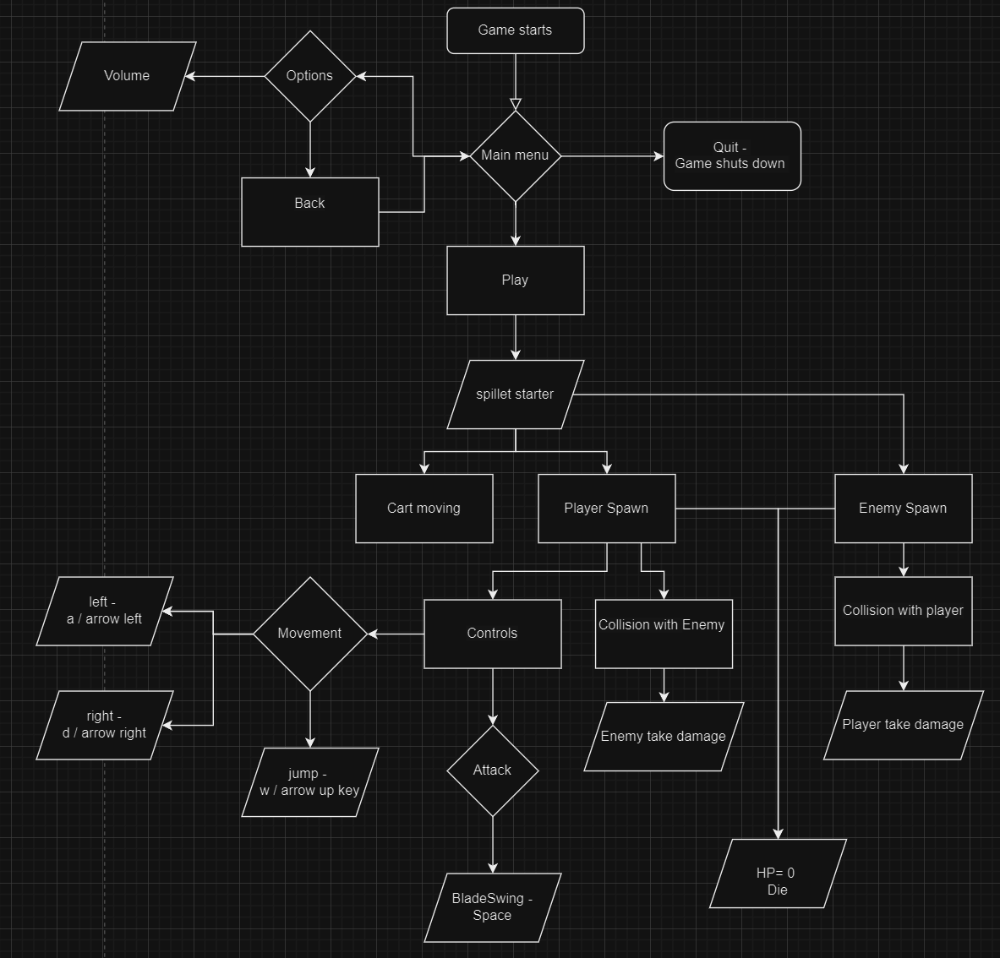

## General Information

Vi har vores Player.cs dette er et script tilknyttet til vores spillerkarakter i spillet, hvilket inkluderer egenskaber som damage, WalkSpeed, JumpForce, og maxHP, som styrer spillerens evner i spillet. Der er også metoder som TakeDamage, som bruges til at reducere spillerens hp og hvis spilleren rammer 0 hp bliver han fjernet, han tager damage ved at den collider bliver ramt af enemy collider. Spilleren kan dræbe enemies ved at gøre nok damage til dem dette gøres på samme måde som enemies tager damage.

